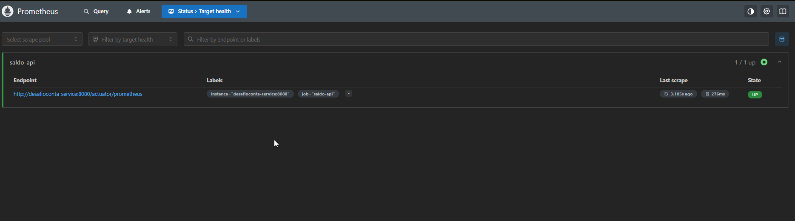
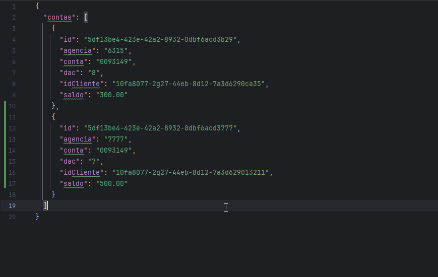

# Desafio técnico - Backend

Olá esse projeto tem com intuito de um teste para a vaga em questão de Backend - SR.


## Detalhes importantes

Realizei uma implementação com base no requisitos enviados na documentação. Sobre o projeto incluir algmas camadas de controller, service e infra para conceitos relacionado ao SOLID e divisão de responsabilidade.

O desafio bem completo, mas com alguns detalhes bem básicos para construção de software. Escolhi uma abordagem simples para o case especificado.

Esse readme foi escrito no site: [readme.so](https://readme.so) 

Ferramenta muito útil para construção de documentações em arquivos .md


---

## Tecnologias Utilizadas

- Java 17
- Spring Boot 3.x
- Spring Web / Feign Client
- Spring Actuator + Micrometer (Prometheus)
- JUnit 5 + Mockito
- Docker & Docker Compose
- Json-Server (Mock API)
- Prometheus & Grafana

---


## Rodando localmente

Clone o projeto

```bash
  git clone https://github.com/wsbdeveloper/desafio-backend
```

Realizar o build do projeto Spring Boot para melhor experiência e realizar o build do projeto para gerar o arquivo de build.

### Executar o docker-compose

No diretório do projeto existe um docker-compose que está toda configuração das imagens e containers da aplicação com as configurações de comunicação já prontas.


```bash
docker-compose up .
```

No intellij existe algumas ferramentas que pode ajudar a executar o running e verificar os estados das imagens e logs para nos auxiliar.


## Detalhes da execução

- Todas imagens rodando corretamente.


## Tratamento de Erros

- Detalhamento de erro com o sprint boot.

Nos erros implementado o ControllerAdvice para melhor gerenciamento dos erros na camada de controller (application) 
com isso evitamos expor nossas apis com logs, que contém muita informação interna visando na segurança da aplicação.


## Resposta com sucesso

- Detalhamento de sucesso na comunicação entre a apimock e apijava.


## Resposta do Endpoint da API

- Todas imagens rodando corretamente.


## Prometheus



## Grafana


## Persistencia de dados usando PostgresSQL

Atribuindo novo recurso na nossa api de simulação de integração.



Chamando a API com o novo recurso atualizado no docker.


Conta atribuida ao banco de dados usando Postgres.


## Sobre mim

- wellingtons.bezerra@hotmail.com  
- [LinkedIn](https://linkedin.com/in/wellington-bezerra-dev)
- (11) 99001-3439
